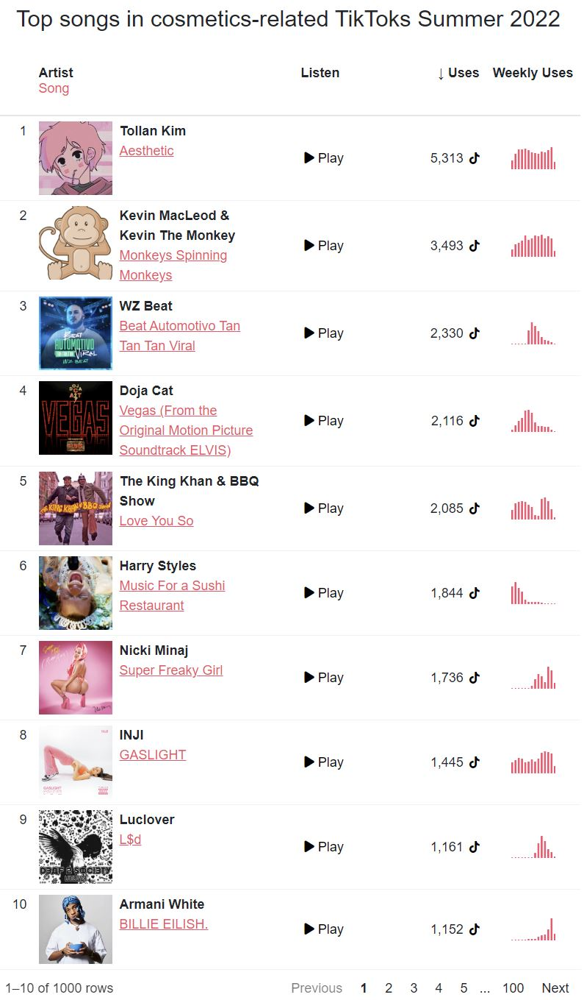

# table-contest-2022

This repository is a contribution to the [Posit Table Contest 2022](https://www.rstudio.com/blog/rstudio-table-contest-2022/). We provide a single table submission in the category interactive-HTML. Visit our GitHub Pages page to explore the [rendered version](https://qagentur.github.io/table-contest-2022/).

Static preview:

## About

What's hot on #BeautyTok? The table lets you explore the most popular songs that users have featured in the cosmetics-related videos from Summer 2022. Each song conveys a different mood: from dreamy and whimsical to energetic. Each is a community-vetted earworm. Listen to the hits, discover trends and compare metrics in this interactive table.

## Technology

The table was built and styled in R with the packages [reactable](https://glin.github.io/reactable/) and [reactablefmtr](https://kcuilla.github.io/reactablefmtr/), [sparkline](https://github.com/htmlwidgets/sparkline) and custom JavaScript, HTML, CSS. It features a custom audio player, custom cell arrangements with album covers, and the use of spark lines. The icons are from [Font Awesome](https://fontawesome.com).

## Data

The dataset comprises 1,000 popular songs on TikTok and is formatted as an RDS file.

The columns are:

-   `music_id`: chr, unique ID of the song
-   `song_title`: chr, name of the song
-   `artist`: chr, name of the artist
-   `play_url`: chr, url to the audio file hosted by TikTok
-   `n_tiktoks`: int, number of times the song was used in TikToks
-   `weekly_tiktoks`: list, contains a numeric vector for each row that has the number of uses by week from 2022-06-01 to 2022-08-31
-   `weeks`: list, contains a yearweek vector (via [tsibble::yearweek()](https://tsibble.tidyverts.org/reference/year-week.html)) indicating the timing of the `weekly_tiktoks` column

The dataset is an excerpt from a large database of TikTok videos, TikTok songs, and their relationships. The data was collected from TikTok by [Cosmention](https://cosmention.com), a social media monitoring tool specialized for the cosmetics industry. Only videos that were classified as cosmetics related are included. The classification was done via a [spaCy](https://spacy.io) model.

## Authors

Built by Paavo Huoviala, Swen Sieben and Paul Simmering at [Q Insight Agency](https://teamq.de/en).
